<div align="center">
  <h1> Git Nedir</h1>
  <a class="header-badge" target="_blank" href="https://www.linkedin.com/in/ismail-baran-karasu-a98916227/">
  
  </a>
  <a class="header-badge" target="_blank" href="https://twitter.com/ismaiBaranK">
  
  </a>

<sub>Yazar:
<a href="https://www.linkedin.com/in/ismail-baran-karasu-a98916227/" target="_blank">İsmail Baran KARASU</a><br>
<small> Ekim, 2023</small>
</sub>

</div>
Git, yazılım geliştirme süreçlerinde kullanılan, hız odaklı, dağıtık çalışan bir sürüm kontrol ve kaynak kod yönetim sistemidir. İlk sürümü Linux çekirdeği'nin geliştirilmesinde kullanılmak üzere 2005 yılında bizzat Linus Torvalds tarafından tasarlanıp geliştirilmişdir.

Git sürüm kontrol sistemini kullanan her bir çalışma dizini (proje), internet erişimi ya da merkezi bir depo olmaksızın tüm tarihçeyi tutan ve sürüm kontrol sisteminin tamamını içinde barındıran tam yetkili birer depodur. Aynı çalışma dizininin birçok depodan birindeki kopyasında yapılan değişiklikler diğerlerine güven temelli bir değerlendirmeyle kabul edilir; Güvenilmeyenden değişiklik alınmaz, o kendi ayrı sürümünü geliştirmeye devam eder.

Git'in şu anki yazılım bakıcılığını Junio Hamano üstlenmiş durumda. Git, GNU Genel Kamu Lisansı'nın 2. sürümüyle lisanslanmış bir özgür yazılımdır. 2.26.0 sürümünden itibaren Türkçe dil desteği sunmaktadır.


# Git İle İlgili Temel Kavramlar 
1.<b> Depo (Repository):</b> Git projelerinin temelini oluşturan depo, proje dosyalarının ve sürüm geçmişinin saklandığı yerdir. Bu depo, yerel bir bilgisayar üzerinde veya uzak bir sunucuda bulunabilir.
2. <b>Taahhüt (Commit):</b> Bir taahhüt, projenin belirli bir anında yapılan değişikliklerin bir görüntüsünü temsil eder. Taahhütler, projenin sürüm geçmişini oluşturan temel yapı taşlarıdır.
3. <b>Dal (Branch):</b> Git projeleri genellikle farklı özellikler veya geliştirmeler üzerinde çalışırken farklı dallara ayrılır. Ana dal (genellikle "master" veya "main" olarak adlandırılır), projenin ana sürümünü temsil eder.
4. <b>Birleştirme (Merge)</b>: Farklı dallardaki değişiklikleri birleştirme işlemidir. Bu, farklı geliştiricilerin çalışmalarını bir araya getirme veya yeni bir özellik eklerken ana dala dahil etme sürecini içerir.
5. <b>İstemci ve Sunucu (Client and Server):</b> Git, hem yerel bilgisayarlarda çalışabilen bir istemci olarak hem de uzak depolara erişim sağlayabilen bir sunucu olarak kullanılabilir. GitHub ve GitLab gibi hizmetler, uzak sunucular sağlar ve işbirliği yapmayı kolaylaştırır.

# Git Nasıl Kullanılır
## 1- Projeniz için yerel Git deposu (repository) oluşturma
Projeniz yeni olsun veya olmasın tek satır komutla projeniz için Git deposu oluşturabilirsiniz.
Komut ekranını açın ve komut ekranından proje klasörünüze ilerleyin. Projenizin ana klasöründe olduğunuzdan emin olduktan sonra <b>‘git init’</b> komutunu girin.

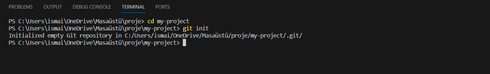

Projemizde <b>.git</b> adında gizli bir klasör oluşması gerekiyor. Şimdi de <b>‘git status’</b> komutunu girelim. Bu komut projemizde en son yapılan kayıttan (commit) sonra yapılan değişiklikleri gösteyor. Biz daha önce herhangi bir kayıt yapmadığımız için de şu an bütün dosyalar yeni birer değişiklik olarak görünmekte.

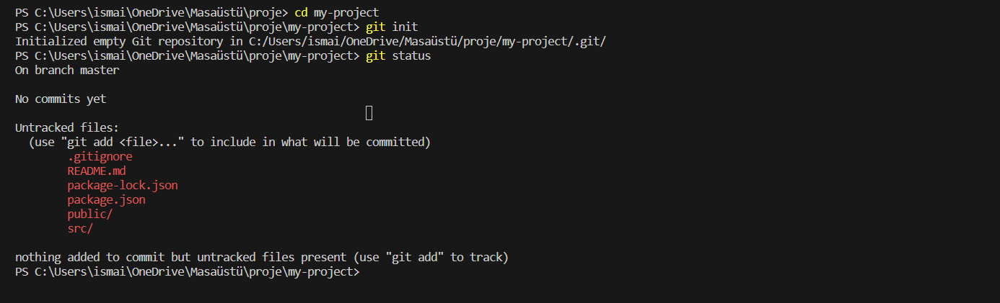

Şimdi de bütün dosyalarımızı kayıt listesine ekleyip ardından da kayıt yapacağız. Bunun için <b>‘git add .’</b> komutunu girin. Normalde <b>‘git add’</b> komutunun en sonuna eklemek istediğiniz dosyayı belirtirsiniz. Bizim komut sonunda kullandığımız nokta ise bütün dosyaları ekle anlamına gelmekte.

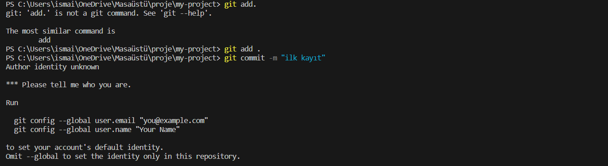

Fakat bunu yaparken bir hata alıyorum ve kullanıcı adı ile mailimi git yazılımına tanıtmamı istiyor:

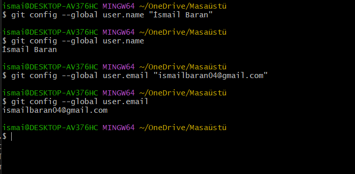

Kayıt işlemi için de <b>‘git commit -m “ilk kayit” ’</b> komutunu girin. Bu komutu girdiğiniz anda ekrana projenizdeki bütün dosyaların tek tek eklendiğini belirten satırlar görürsünüz.

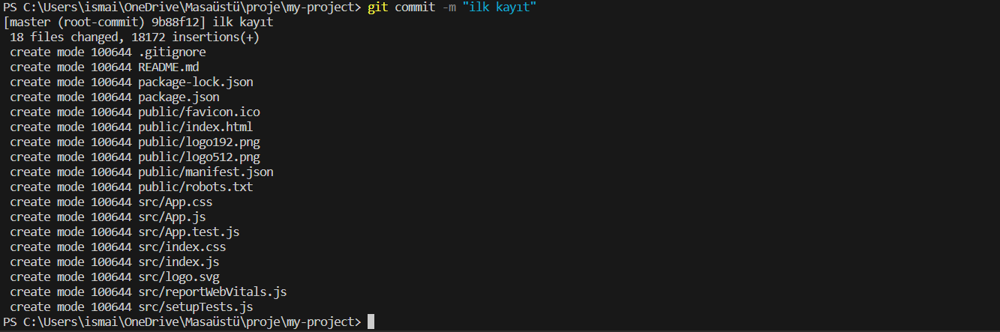

Şu an tekrar <b>‘git status’</b> komutunu girersek ekranda en son yapılan kayıttan sonra herhangi bir değişiklik yapılmadığını gösteren bir yazı görücez.

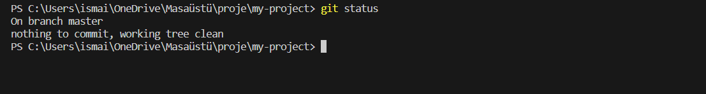

Artık bilgisayarımızda projemiz için Git depomuz var. Projemiz üzerinde istediğimiz çılgınlıkları yapabiliriz. Çükü bir şeyleri bozarsak projemizi eski çalışan haline döndürmek artık tek satır komutla mümkün olacaktır.

## 2- Temel Git komutları ve kullanımı
Şimdi de Git komutlarından en çok kullanılanları açıklayıp bir iki örnek göstereceğim.

Gidip projenizde herhangi bir dosyada birkaç değişiklik yapın ve sonra <b>‘git status’</b> komutunu kullanarak bu değişikliklerin deponuza nasıl yansıdığını görün. Ben projemde <b>App.js</b> dosyasında değişiklik yaptım ve sonuç bu şekilde oldu.

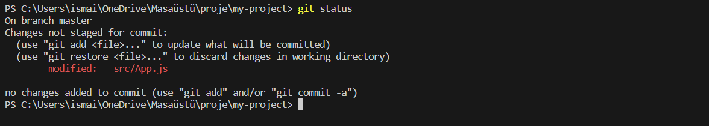

Komut satırında son kayıttan sonra değişen dosyaların listesini görebilirsiniz. Şu an da yapacağımız şey dosyaları kayıta eklemek ve sonra da kayıt işlemini yapmak. Bunu biraz önce yaptığımız gibi sırasıyla <b>‘git add .’</b> ve <b>‘git commit -m “ikinci kayıt” ‘</b> şeklinde yapabilirsiniz. Ama bu sefer dosyaları ekleme komutunu kayıt komutuyla birleştirerek yapacağız. Komut satırına <b>‘git commit -am “ikinci kayıt” ‘</b> komutunu girin. Burada ek olarak kullandığımız a harfi kayıt işlemini yaparken bütün değişikliğe uğramış dosyaları da kayıta ekleyecektir.

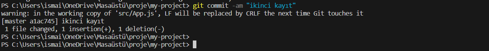

### Yapılan değişiklikleri görme

Kayıt işlemini yapmadan önce <b>‘git diff’</b> komutunu kullanarak kaydedilmeyen değişikliklerin (eklenen ve çıkarılan satırların) ne olduğunu görebilirsiniz. Uzun bir dosyada değişiklik yapıldıysa <b>‘enter’</b> tuşunu kullarak satır satır ilerlemeniz gerekmektedir. Dosyanın sonuna gelmek istemiyorsanız da klavyeden <b>‘q’</b> tuşuna basıp çıkabilirsiniz.

### Yapılan değişiklikleri geri çevirme

Eğer yaptığınız değişiklikleri kaydetmek istemiyorsanız (örneğin son değişiklikler projenin bozulmasına sebep oldu ve geri eski haline döndürmek çok uzun sürüyorsa) <b> ‘git reset —hard HEAD’</b> komutuyla projenizi en son kayıt yapılan haline döndürebilirsiniz.

## 3-Projenizi uzak bir depoya (remote repository) yerleştirme

Projenizi uzak bir depoya yerleştirmek için önce öyle bir depoya sahip olmanız gerekmekte. İnternette bu hizmeti sağlayan GitHub ve BitBucket gibi servisler bulabilirsiniz. Ben yazının devamında GitHub üzerinden devam edeceğim.

GitHub’a kayıtlı değilseniz kaydolun. Eğer programcı olarak uzun yıllar çalışmayı düşünüyorsanız kesinlikle bir GitHub hesabı açmanız gerek. Profil sayfanızı açtığınızda orta kısımda üç tane sekme göreceksiniz. Bunlardan ilki (contributions) sahip olduğunuz veya katkı yaptığınız projeleri gösterir. İkinci kısım da (repositories) sahip olduğunuz veya üzerinde yetki sahibi olduğunuz depoları gösterir. Son sekme de (public activities) GitHub üzerindeki projelerde aleni yaptığınız faaliyetleri görürsünüz.

Şu an yapmamız gereken şey depolar sekmesine girip oradaki yeni düğmesine (en sağdaki yeşil düğme) basarak yeni bir depo oluşturmaktır.


Karşınıza çok basit bir form çıkacaktır. Formun en üstünde deponun sahibi olacak hesabı seçebileceğiniz (GitHub’da birden fazla hesap ile çalışıyorsanız) ve deponun ismini girebileceğiniz kısımlar var. Onların hemen altında da projenin basit bir açıklamasını gireceğiniz ve projenin herkese açık olup olmadığını seçebileceğiniz kısımlar var.
Formun en altında da projenizi ‘beni oku dosyasıyla beraber oluştur’ diye bir seçenek var biz onu kullanmayacağız. Onun hemen altında da iki tane seçenek var. Bunların açıklaması kısaca şöyle:
 1. <b>.gitignore:</b> Bu dosya proje içinde bulunan ama uzak depoda bulunmasını istemediğiniz dosyaları içerir. Genelde asıl kullanım amacı, proje derlendiği zaman oluşan dosyaları uzak depoya koymamaktır. Ayrıca kullandığınız IDE e bağlı dosyaların da uzak depoya konmasını engelleyebilirsiniz. Çünkü bu dosyalar siz bilgisayarınızda derleme yaptığınızda oluşacaktır. Ayrıca her proje türünde (web, ios, android) konması gereksiz olan dosya türleri farklıdır.
 2. <b>licence:</b> Lisans da depoya koyduğunuz projenin başkaları tarafından kullanılması durumunda sorumlu olacakları lisans şartlarını içerir.
Bu projemiz için bunları da geçeceğiz ama ileride .gitignore kullanmanızı şiddetle tavsiye ederim.

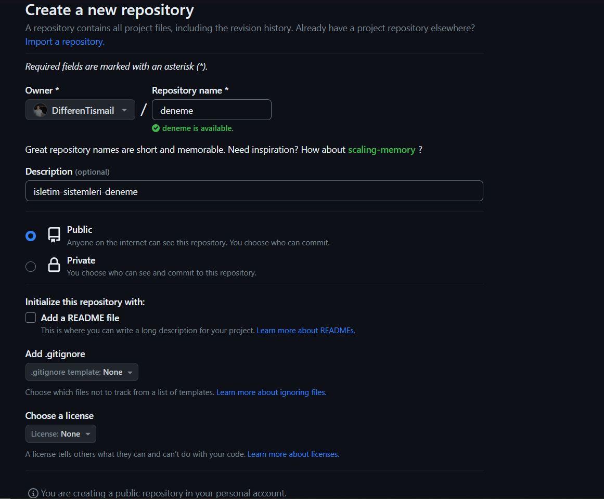


Ben şimdilik deneme adında bir proje oluşturuyorum. Daha sonra depoları silebildiğiniz şu için isime çok da önem vermeyebilirsiniz.

Create repository düğmesine basarak deponuzu oluşturun. Depo oluştuktan sonra karşınıza çıkan sayfada projenizi bu depoya nasıl koyabileceğinizi anlatan bir kısım göreceksiniz. Bizim zaten bir git projemiz olduğundan sadece projemizi bu depoya yükleme işlemi yapacağız. O da sayfadaki bu kısımda anlatılmış vaziyette zaten.

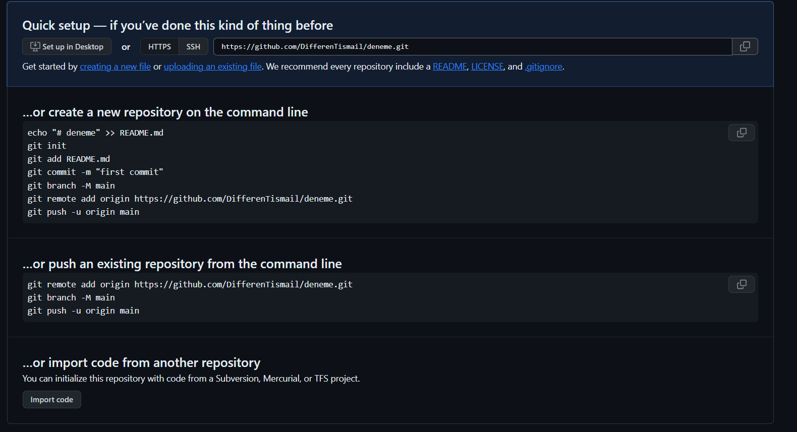

Projenizde yapılan değişiklikleri tekrar <b>git status</b> komutuyla kontrol edin ve kayıt edilmemiş bir değişiklik varsa bunları <b>git commit -am “kayıt mesajı”</b> komutuyla kaydedin. Ve artık bize GitHub sayfasında da gösterildiği gibi<b> ```git remote add origin  https://github.com/DifferenTismail/deneme.git```</b> komutuyla projenizi uzak deponuz ile eşleştirebilirsiniz. (Tabi bu komutu kullanırken kendi deponuzun URL’sini kullanmalısınız.) Bu esnada size github hesabınız için kullanıcı adı ve parola sorulacaktır. Bu bilgileri de girerseniz projeniz uzak depo ile eşleşmiş olacaktır.

Ancak projenizi deponuzda hemen göremezsiniz. Projenizi depoya göndermek için de <b>git push -u origin master</b> komutunu kullanmalısınız. Bu komutu girdikten sonra komut satırında yükleme işlemi yapıldığını göreceksiniz. Bu esnada projeniz uzak depoya yükleniyor olacaktır ve sonuç olarak da komut ekranınız buna benzer bir sonuç göstermelidir.

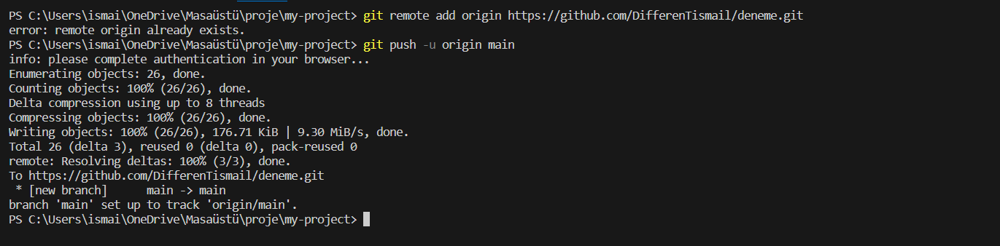

Şimdi GitHub’daki proje sayfanıza giderseniz biraz önce size projenizi nasıl ekleyeceğiniz anlatan mesajlar yerine projenizin dosyalarını göreceksiniz.

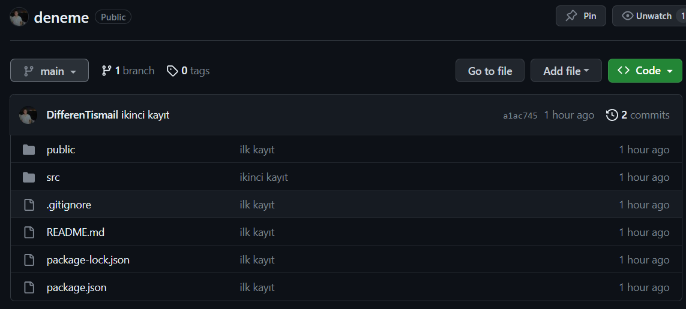

## Yapılan Değişikliği Uzak Depoya Kaydetme
Artık bilgisayarımızda yerel bir git projesi ve uzakta da buna karşılık gelen bir uzak depo bulunmakta. GitHub içinde klasörlerde gezinerek dosyalarınıza bakabilirsiniz. Şimdi projede değişiklik yapıp bunu uzak depoya kaydedeceğiz.

Ben kendi projemde App.js dosyamdaki veriyi değiştiriyorum.

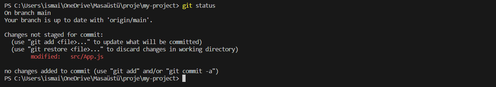

Uzak deponuzda GitHub sayfasından değişiklik yaptığınız dosyayı açarsanız orada bir değişikliğin olmadığını göreceksiniz.
Şimdi de ```git commit -am “ilk degisiklik”``` komutuyla değişikliği kayıt altına alın. Bu aşamada hala uzak deponuzda bir değişiklik olmayacaktır. Push komutunu kullanana kadar yaptığınız bütün değişiklikler yerel git deponuzda kalır. Bu değişikliklerin uzak depoda da etkisini göstermesini istiyorsanız ``` git push origin main ```komutunu kullanın.

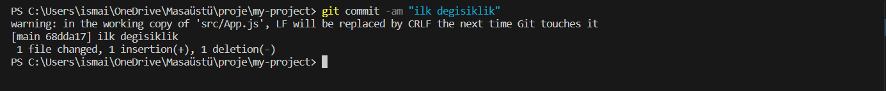
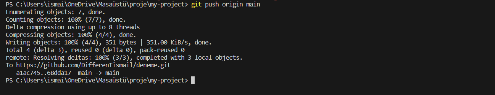

Bu komuttan sonra GitHub sayfasından değişiklik yaptığınız dosyayı açarsanız değişikliklerin buraya da yansıdığını görebilirsiniz.
